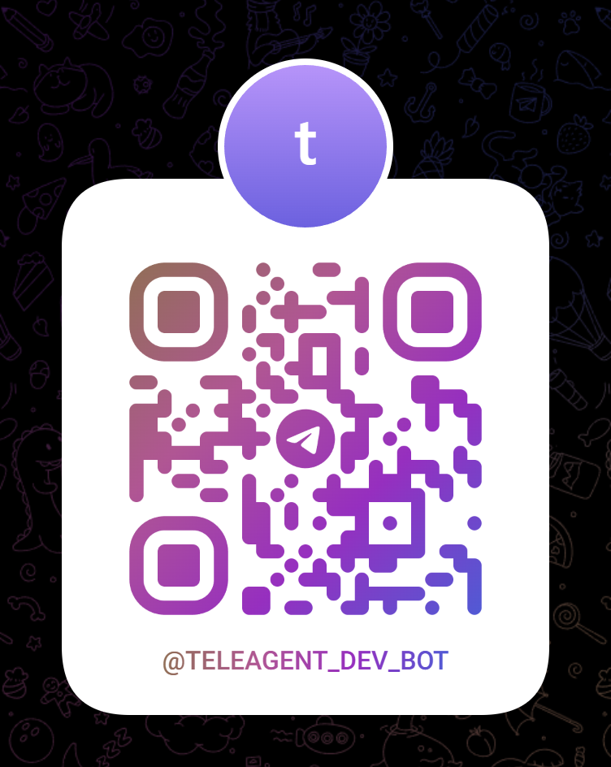
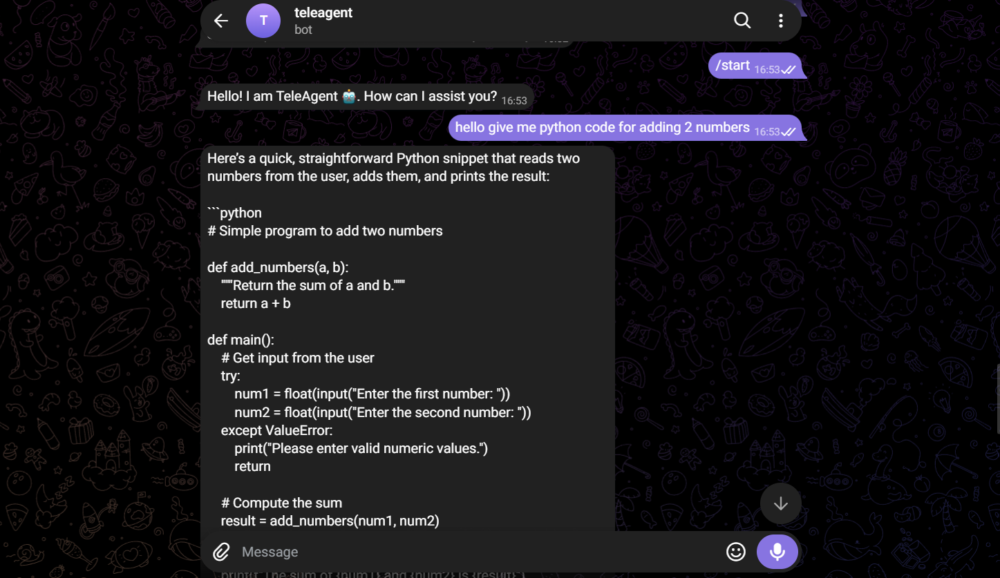
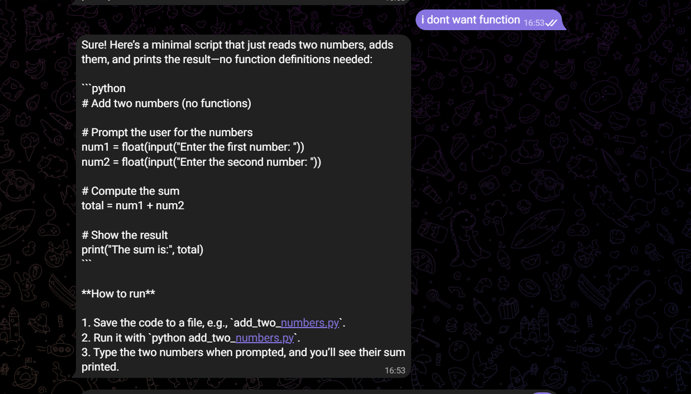

# 🤖 TeleAgent

**TeleAgent** is an AI-powered Telegram chatbot built with **Python, Aiogram 3, and Groq**.

It connects Telegram with a Groq-powered LLM to provide conversational AI directly inside Telegram. The project demonstrates practical integration of asynchronous Python, Telegram bot handlers, environment variables, LLM APIs, and conversation context.

## ✨ Features

- 🤖 AI chatbot inside Telegram
- ⚡ Powered by the Groq API
- 🧠 Conversation context / message history
- 💬 Natural-language chat through Telegram
- `/start` — Start the bot
- `/help` — Display available commands
- `/clear` — Clear the stored conversation context
- 🔐 API keys loaded securely from `.env`
- ⚙️ Asynchronous Telegram bot using Aiogram 3

## 🏗️ Architecture

```text
Telegram User
      │
      ▼
 Telegram Bot
      │
      ▼
   Aiogram 3
      │
      ▼
 Message Handler
      │
      ├── Conversation History
      │
      ▼
    Groq API
      │
      ▼
 groq/compound-mini
      │
      ▼
 AI Response
      │
      ▼
 Telegram User
```

## 🛠️ Tech Stack

| Technology | Purpose |
|---|---|
| Python | Core programming language |
| Aiogram 3 | Telegram Bot framework |
| Groq | LLM API |
| Groq Compound Mini | AI model used by the bot |
| python-dotenv | Environment variable management |
| asyncio | Asynchronous execution |

## 📁 Project Structure

```text
teleagent-ai/
│
├── research/
│   └── telebot.py
│
├── outputs/
│   ├── 1.png
│   ├── 2.png
│   └── image.png
│
├── main.py
├── .env
├── .gitignore
├── pyproject.toml
├── req.txt
├── README.md
└── uv.lock
```

> Keep `.env` out of Git. Your API keys should never be committed to the repository.

## 🚀 Getting Started

### 1. Clone the repository

```bash
git clone https://github.com/<your-username>/teleagent-ai.git
cd teleagent-ai
```

### 2. Create and activate a virtual environment

Windows:

```bash
python -m venv .venv
.venv\Scripts\activate
```

### 3. Install dependencies

```bash
pip install -r req.txt
```

Or install the main dependencies directly:

```bash
pip install aiogram groq python-dotenv
```

### 4. Create a Telegram bot

Open Telegram and start a conversation with **BotFather**.

Create a new bot and copy the bot token.

### 5. Get a Groq API key

Create a Groq API key and keep it private.

### 6. Configure environment variables

Create a `.env` file in the project root:

```env
TELEGRAM_BOT_TOKEN=your_telegram_bot_token
GROQ_API_KEY=your_groq_api_key
```

Do **not** upload this file to GitHub.

Add it to `.gitignore`:

```gitignore
.env
.venv/
__pycache__/
*.pyc
```

## ▶️ Run the Bot

From the project root:

```bash
python main.py
```

You should see:

```text
Token loaded: True
Bot is starting...
```

Open Telegram, start the bot, and send `/start`.

## 📱 Use TeleAgent

### Scan the QR code

Scan the QR code below with your phone to open the TeleAgent bot directly in Telegram.



**Telegram:** `@teleagent_dev_bot`

You can also search for **@teleagent_dev_bot** directly in Telegram.

> **Note:** Keep your bot token private. The QR code only points users to the Telegram bot and does not expose your API credentials.

## 💬 Available Commands

| Command | Description |
|---|---|
| `/start` | Starts the bot |
| `/help` | Shows the help menu |
| `/clear` | Clears the stored conversation context |

## 🧠 Conversation Context

The bot maintains a message history and sends previous conversation turns to the Groq model.

For example:

```python
messages = [
    {"role": "system", "content": "You are a helpful assistant"},
    {"role": "user", "content": "My name is Pramod"},
    {"role": "assistant", "content": "Nice to meet you!"},
    {"role": "user", "content": "What is my name?"},
]
```

This allows the model to use previous turns when generating the next response.

The `/clear` command resets the stored context.

> The current implementation keeps conversation history in memory while the application is running.

## 📸 Output

### Telegram Bot

The bot responds to user messages through Telegram and sends the generated Groq response back to the user.



### Additional Output



## 🔑 Environment Variables

| Variable | Description |
|---|---|
| `TELEGRAM_BOT_TOKEN` | Token generated by Telegram BotFather |
| `GROQ_API_KEY` | API key used to access Groq |

Never expose either value publicly.

## 👨‍💻 Author

**Pramod B**

Built as a practical AI engineering project while exploring LLMs, agentic AI, and production-oriented Python applications.

---

⭐ If you find this project useful, consider starring the repository.
